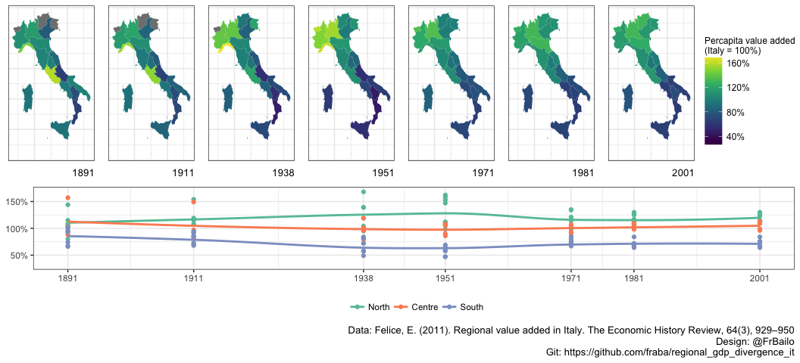

References
==========

-   Geloso, V. (December, 2016). The uniqueness of Italian internal divergence. <https://notesonliberty.com/2016/12/06/the-uniqueness-of-italian-internal-divergence/>
-   Felice, E. (2011). Regional value added in Italy, 1891–2001, and the foundation of a long-term picture. The Economic History Review, 64(3), 929–950. <https://doi.org/10.1111/j.1468-0289.2010.00568.x>
